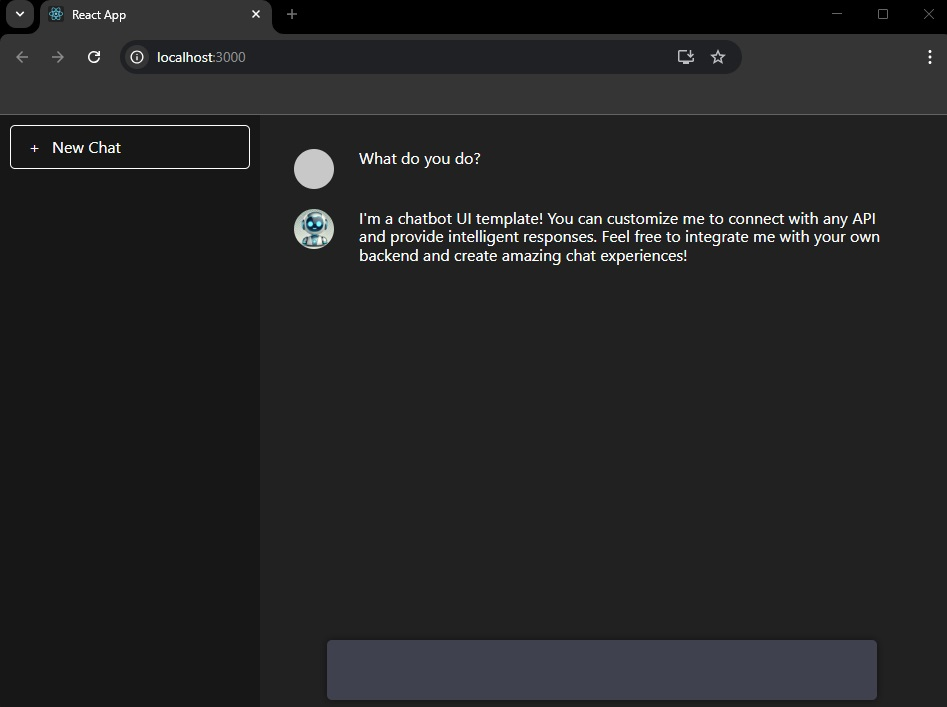

# Chat UI Template  

A simple and customizable chat UI built with React, designed as a 
template for chatbot projects.  



## 🚀 Features  

- Clean and simple interface
- Easily customizable for different chatbot projects  
- Built with React and styled with CSS 
- Open-source and ready for integration  

## 📦 Installation  

Clone the repository:  
```bash
git clone git@github.com:franciscosanchezoliver/chatai.git
cd chatai
```

Install dependencies:  
```bash
npm install
```

## 💻 Usage  

Start the client:
```bash
cd client;
npm start;
```

To customize the UI, modify the `src/components` folder.  
To customize the style, modify the `App.css` file.


## 📜 License  

This project is open-source under the [MIT License](LICENSE).  

---

Would you like me to add anything else, like a demo screenshot or deployment instructions? 🚀

### How to test the Mock Backend

#### Powershell
```powershell
$messages = @(
	@{ role = "system"; content = "You are a helpful assistant" },
	@{ role = "user"; content = "Hello, how are you?" }
)

$messages = @(
    @{ role = "system"; content = "You are a helpful assistant." },
    @{ role = "user"; content = "Hello, how are you?" }
)

$body = @{ messages = $messages } | ConvertTo-Json -Depth 10

$response = Invoke-RestMethod -Uri "http://localhost:3001/chat" `
                              -Method Post `
                              -Headers @{ "Content-Type" = "application/json" } `
                             -Body $body

```